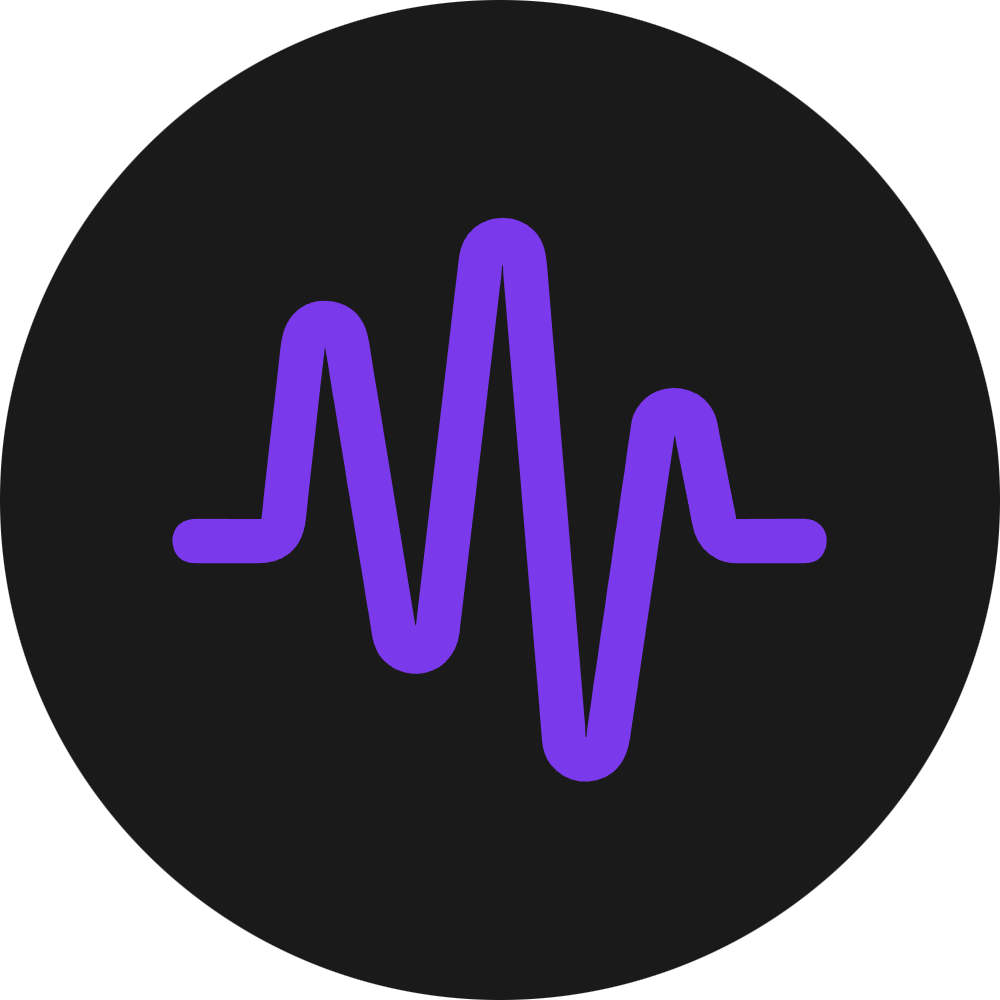
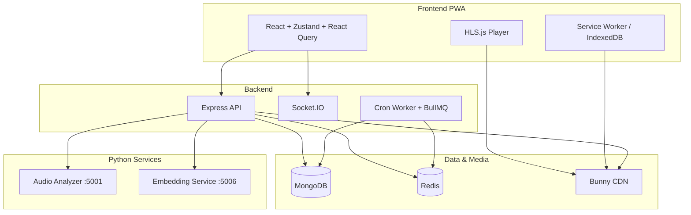

<p align="center">
  
</p>

<h1 align="center">Moodify Music</h1>

<p align="center">
  A full-featured music streaming platform with adaptive playback, personalization, and real-time social features.
</p>

<p align="center">
  <strong>Live:</strong> <a href="https://moodify-music.com/">moodify-music.com</a>
</p>

---

## Overview

**Moodify Music** is a production-grade streaming app built with **React**, **Express**, and **HLS.js**. It combines catalog browsing, a personalized home feed, smart playlists, offline playback, and a social layer inspired by Spotify Friend Activity — all optimized for performance and mobile use.

The repository is a monorepo:

| Directory | Role |
|-----------|------|
| `frontend/` | React + TypeScript PWA (Vite) |
| `backend/` | Express API, Socket.IO, cron worker, admin endpoints |
| `analyzer/` | Python microservice — BPM, key, Camelot, beat grid (Essentia + Madmom) |
| `embedding/` | Python microservice — MusiCNN audio embeddings for recommendations |

---

## Features

### Playback

- **Adaptive HLS streaming** via `hls.js` and CDN-hosted segments
- **Queue management** — user queue, drag-and-drop reorder, repeat/shuffle, smart shuffle for large playlists
- **Web Audio effects** — 6-band parametric EQ with presets, convolution reverb, loudness normalization, playback speed
- **Waveform analyzer** — real-time oscilloscope-style visualization
- **Synced lyrics** — LRC-timestamped lyrics for tracks that have them
- **Autoplay** and context-aware playback (album, playlist, artist)

### Discovery & Personalization

- **Personalized home feed** — sections generated from listening history and taste profile
- **Genre & mood hubs** — curated entry points into the catalog
- **Smart playlists** — Discover Weekly-style mixes, On Repeat, On Repeat Rewind, and taste-based personal mixes
- **Search** — regex-based search across albums, artists, playlists, and tracks
- **Taste onboarding** — pick 3–20 favorite artists to bootstrap recommendations

### Social

- **Real-time chat** — text messages and shared tracks, albums, and playlists (`Socket.IO`)
- **Friend activity** — see what mutual followers are listening to (online or within the last 7 days)
- **User profiles** — public playlists, top tracks this month, and recently listened artists

### Offline & Privacy

- **Offline mode** — download albums and playlists to IndexedDB; HLS segments and covers cached by the Service Worker
- **Anonymous mode** — hides you from friend activity and skips listen-history recording
- **PWA** — installable app with Workbox runtime caching

### Platform

- **Authentication** — email/password with verification codes (Resend), Google OAuth, password reset
- **Internationalization** — English, Russian, and Ukrainian (`i18next`)
- **Admin API** — album/song upload, HLS transcoding pipeline, catalog maintenance
- **Jamendo import** — optional royalty-free catalog ingestion script

---

## Tech Stack

### Frontend

- React 19, TypeScript, Vite 6
- Tailwind CSS 4, Radix UI / shadcn-style components
- Zustand (player, auth, offline, chat, UI state)
- TanStack React Query (server data)
- HLS.js, Web Audio API
- Socket.IO client, i18next
- vite-plugin-pwa + Workbox

### Backend

- Node.js, Express 5, ESM
- MongoDB (Mongoose), Redis, BullMQ
- Socket.IO (chat + friend activity)
- JWT sessions, bcrypt, Resend
- FFmpeg / fluent-ffmpeg for media processing
- Bunny CDN for HLS delivery and image variants
- Google Gemini (playlist locale translation, AI helpers)
- Spotify API (optional — mainly admin album import metadata and cover art)

### ML / Audio Services

- **Analyzer** (port `5001`) — Essentia + Madmom: tempo, key, Camelot wheel, beats
- **Embedding** (port `5006`) — Essentia MusiCNN: 50-dim track embeddings for similarity and hubs

---

## Architecture



The analyzer and embedding services are called during **catalog ingestion** (admin uploads and maintenance scripts), not on every playback request. Cron jobs recompute playlist/home-feed data and category centroids from embeddings already stored in MongoDB.

The API and cron worker run as separate processes (see `backend/ecosystem.config.cjs` for PM2). Home feed generation uses both scheduled cron runs and a BullMQ worker (on-demand, e.g. after onboarding); in development the BullMQ worker also starts inside the API process.

---

## Project Structure

```
Moodify/
├── frontend/
│   ├── src/
│   │   ├── pages/          # Route-level UI
│   │   ├── hooks/queries/  # React Query hooks (legacy layer in this fork)
│   │   ├── lib/api/        # HTTP client helpers (legacy layer in this fork)
│   │   ├── layout/         # App shell, player chrome, navigation
│   │   ├── stores/         # Zustand — player, auth, offline, chat
│   │   ├── components/ui/  # Shared UI primitives
│   │   └── lib/            # Axios, i18n, offline DB, Web Audio, PWA
│   └── public/
├── backend/
│   └── src/
│       ├── routes/         # Thin route wiring
│       ├── controller/     # HTTP handlers
│       ├── models/         # Mongoose schemas
│       ├── lib/            # Services (recommendations, media, integrations)
│       ├── cron/           # Scheduled jobs (separate worker entry)
│       └── scripts/        # Migrations and one-off jobs
├── analyzer/               # FastAPI audio analysis service
└── embedding/              # FastAPI embedding service
```

---

## Getting Started

### Prerequisites

- Node.js 18+
- MongoDB
- Redis
- FFmpeg (for backend media processing)
- Python 3.9+ (for analyzer and embedding services, or use Docker)

### 1. Backend

```bash
cd backend
npm install
# Create backend/.env — see Environment Variables below
npm run dev            # API on http://localhost:5000
```

In a second terminal, start the cron worker:

```bash
cd backend
npm run dev:cron
```

For production, use PM2:

```bash
npm run start:pm2
```

### 2. Frontend

```bash
cd frontend
npm install
# Create frontend/.env — see Environment Variables below
npm run dev
```

### 3. Python services (optional for full recommendation pipeline)

```bash
# Analyzer — default port 5001
cd analyzer
pip install -r requirements.txt
uvicorn app:app --host 0.0.0.0 --port 5001

# Embedding — default port 5006
cd embedding
pip install -r requirements.txt
uvicorn app:app --host 0.0.0.0 --port 5006
```

Docker images are available in `analyzer/Dockerfile` and `embedding/Dockerfile`.

### Environment Variables

**Backend** (`.env` in `backend/`):

| Variable | Description |
|----------|-------------|
| `MONGO_URI` | MongoDB connection string |
| `REDIS_URL` | Redis URL (default `redis://localhost:6379`) |
| `PORT` | API port (default `5000`) |
| `CLIENT_ORIGIN_URL` | Frontend origin for CORS and Socket.IO |
| `ADMIN_ORIGIN_URL` | Admin panel origin (if used) |
| `JWT_SECRET` | Secret for access tokens |
| `JWT_EXPIRES_IN` | Token TTL (default `7d`) |
| `RESEND_API_KEY` | Resend API key for transactional email |
| `EMAIL_FROM` | Sender address for verification/reset emails |
| `BUNNY_PULL_ZONE_HOSTNAME` | Bunny CDN pull zone for HLS and images |
| `ANALYSIS_SERVICE_URL` | Analyzer service URL (default `http://127.0.0.1:5001`) |
| `EMBEDDING_SERVICE_URL` | Embedding service URL (default `http://127.0.0.1:5006`) |
| `GEMINI_API_KEY` | Google Gemini (locale translation, AI features) |
| `SPOTIFY_CLIENT_ID` / `SPOTIFY_CLIENT_SECRET` | Optional Spotify metadata |
| `JAMENDO_CLIENT_ID` | Optional Jamendo catalog import |

**Frontend** (`.env` in `frontend/`):

| Variable | Description |
|----------|-------------|
| `VITE_API_URL` | Backend API base URL |
| `VITE_SOCKETIO_URL` | Socket.IO server URL |
| `VITE_GOOGLE_CLIENT_ID` | Google OAuth client ID (optional) |

---

## Background Jobs

Scheduled tasks (cron worker) include:

- Personal and global genre/mood mix generation
- Discover Weekly, On Repeat, and On Repeat Rewind playlists
- Home feed generation (scheduled cron + BullMQ on-demand queue)
- Trending cache warming
- Category centroids and hub regeneration (from stored embeddings)
- Temp directory cleanup

One-off scripts live under `backend/src/scripts/` — migrations, Jamendo import, embedding pipelines, and catalog generators. See `backend/package.json` scripts for entry points.

---

## API Overview

| Prefix | Domain |
|--------|--------|
| `/api/auth` | Registration, login, Google OAuth, password reset |
| `/api/users` | Profiles, follows, settings |
| `/api/songs` | Tracks, streaming metadata, lyrics |
| `/api/albums` | Album pages and track lists |
| `/api/artists` | Artist pages and discography |
| `/api/playlists` | CRUD, smart shuffle, recommendations |
| `/api/library` | Liked songs, saved albums/playlists |
| `/api/home` | Personalized home feed |
| `/api/hubs` | Genre and mood hubs |
| `/api/search` | Regex search across catalog entities |
| `/api/share` | Share links and OG metadata |
| `/api/admin` | Catalog upload and maintenance (admin role; separate admin UI, not in this repo) |
| `/api/stats` | App stats and ML service health checks |

Real-time events (chat, typing indicators, friend activity) are delivered over Socket.IO on the same server as the HTTP API.

---

## Roadmap

- Collaborative playlists
- React Native mobile app

---

## Author

**Dimon Desh** — Full-Stack Developer & Music Producer

Inspired by sound, built for emotion.
